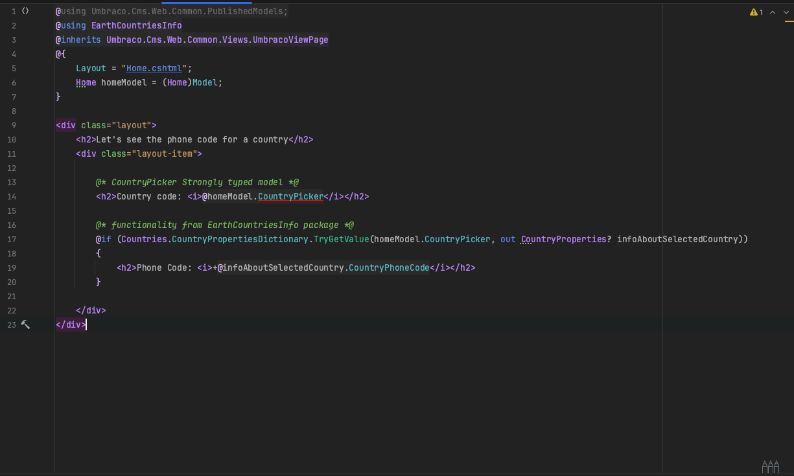
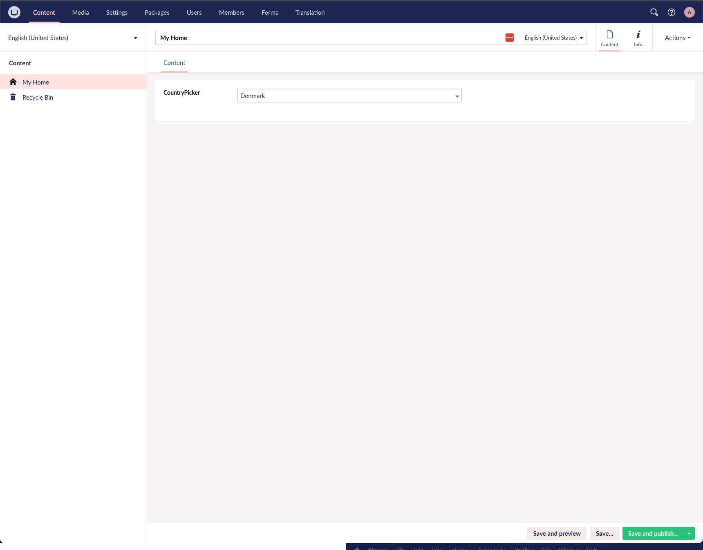
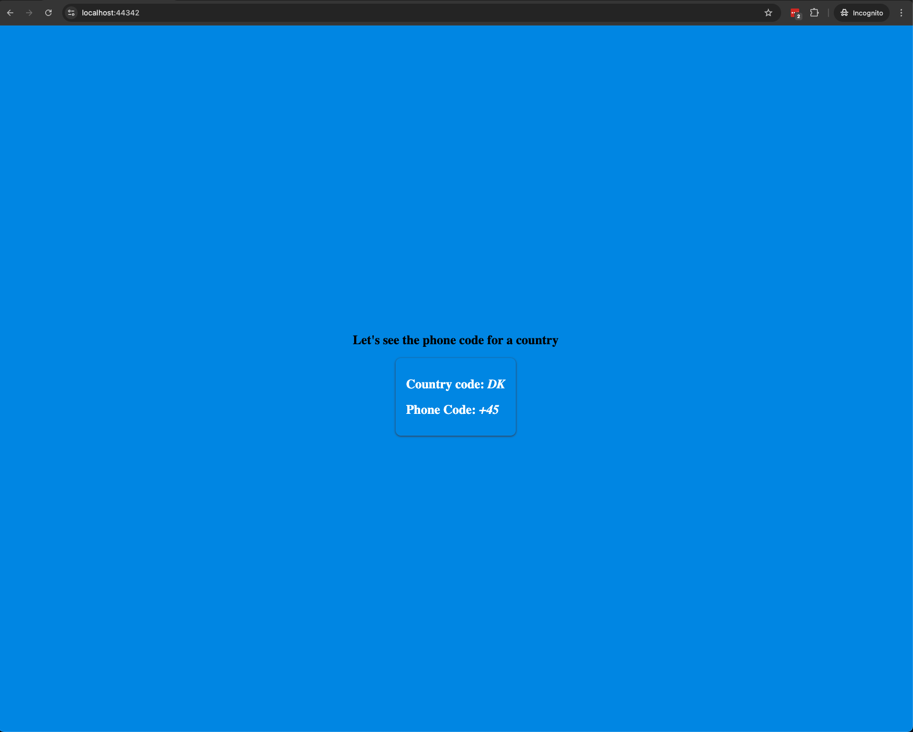
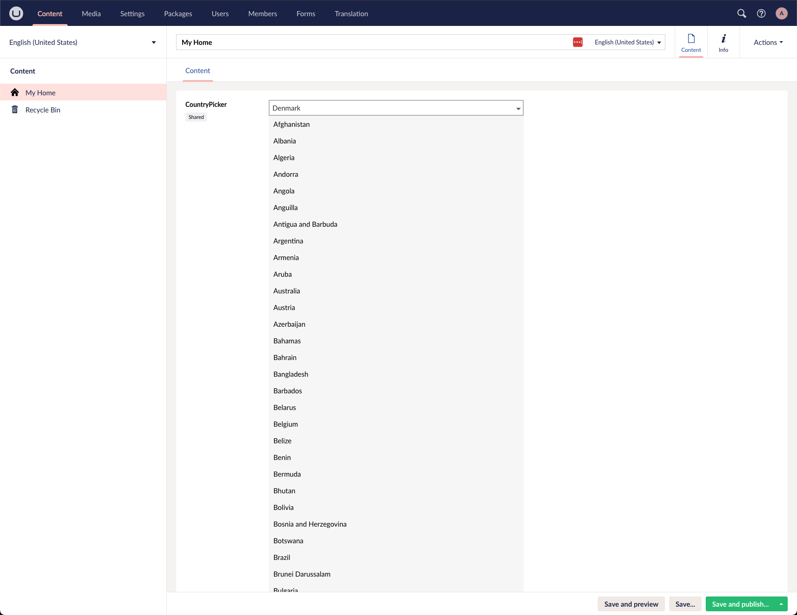
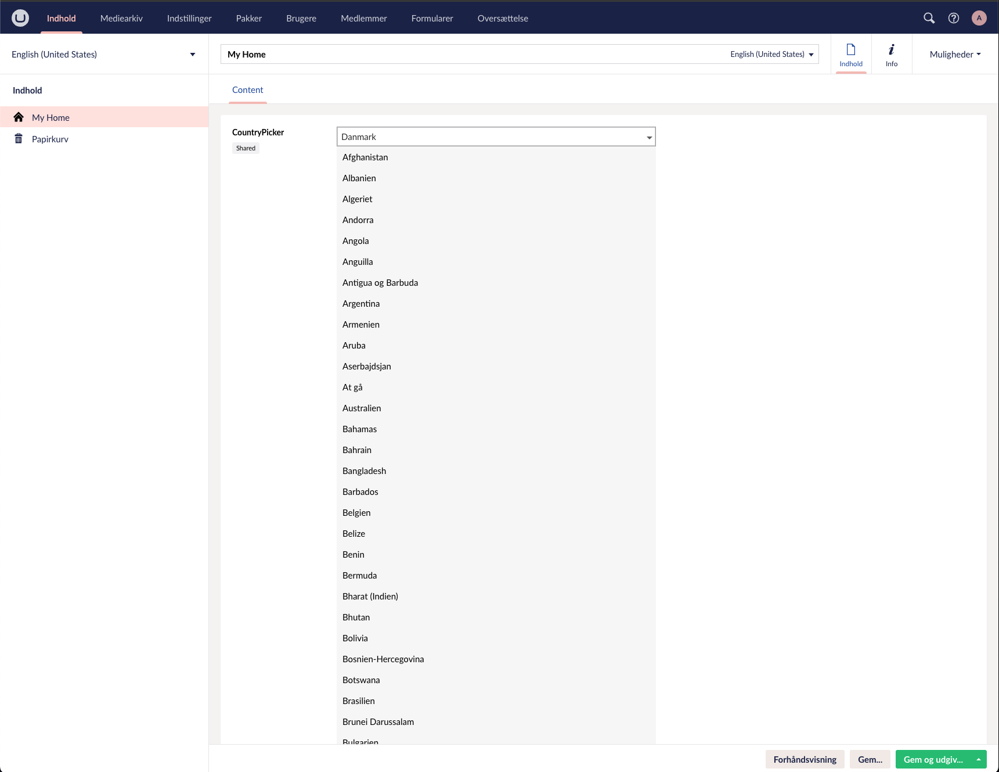

# UmbCountryPicker

A friendly **country picker property editor** for Umbraco CMS.
The perfect dropdown for selecting countries in your Content Editor interface!

---

## Why Use UmbCountryPicker?

* **Intuitive UI**: Provides a simple dropdown that lists countries for content editors.
* **Smooth Integration**: Plug it right into your .NET-powered Umbraco site with minimal fuss.
* **Backoffice Localization**: Country names will be displayed based on the user’s Backoffice language setting.

---

## Features at a Glance

| Feature                       | Description                                            |
| ----------------------------- | ------------------------------------------------------ |
| Dropdown UI                   | Clean, user-friendly country selection in the editor.  |
| .NET Integration              | Register it, use it, done!                              |
| Auto-Translated Country Names | Languages adjust based on Backoffice culture settings. |

---

## Getting Started

### Installation

1. Install the package: `dotnet add package UmbCountryPicker`
2. In your Umbraco backoffice, create a new Data Type.
3. Assign **UmbCountryPicker** as the editor.
4. Use this Data Type wherever you want your country dropdown functionality.

---

## Screenshots & Localization Examples
As an example let's say this is your template code(sprinkled with a bit of CSS):

#### Let's look closer at how the content editor will interact with this and see the output

* **Content Editor View**

* **Frontend Display**

* **Backoffice Localization**

  * Default (en-US)
  
  * Danish (da): Shows dropdown labeled in Danish.
  

---

## Under the Hood

UmbCountryPicker works by pulling in countries via ISO standards from its internally stored list and displays them in the appropriate culture. It includes:

* A manifest and UI component (JavaScript or Razor).
* A value converter (e.g., `CountryPickerValueConverter.cs`) for Umbraco's ModelsBuilder for smooth retrieval of strongly typed country data in templates or views.

---

## License

Licensed under **MIT**, so feel free to use it in personal or commercial projects with peace of mind.

---

## Final Thoughts

UmbCountryPicker keeps things simple, localized, and developer-friendly. It’s almost plug‑and‑play: add to your Data Types, use it in your Document Types, and you're good to go + plus you're freed from managing country lists or translations yourself.
